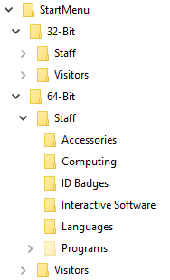

# Shortcut Deploy
This script copies over shortcuts from a network location and hides local shortcuts it can not find on the target machine.

With the script as it stands, the root of the $Source Start Menu folder requires a 32-Bit and a 64-Bit folder, and then have the Start Menus you wish to deploy to certain teams/groups of people (for example Staff, Visiotrs, etc) folders below. So the source folder layout should be simular to this...

Note: If a 32-Bit OS is detected the 32-Bit folders are copied down, if a 64-Bit OS is detected the 64-Bit folders are copied down.
